# PRUEBA BACKEND ALTERNOVA

## Objetivos:
- Crear un proyecto Backend con Django que nos permita consumir unos Endpoints específicos.


- Implementar un sistema de Autenticación para el registro de los usuarios y la seguridad de la información de nuestra base de datos


- Hacer que el proyecto sea funcional y subirlo a un hosting para lograr su funcionalidad en la web


- Realizar un buen análisis del problema para la creación de los modelos de nuestra base de datos


## Clonar el repositorio de GitHub

1. Abre una terminal en el directorio donde quieres clonar el repositorio.


2. Ejecuta el siguiente comando:

```shell
git clone https://github.com/JuanP0329/Pueba-Alternova-Backend.git
```
- Recuerda que para acceder en el proyecto desde la terminal para configurarla y seguir trabajando en ella con GitHub, debes de ejecutar los siguientes comandos
ejemplo:


- En este caso el proyecto se clono en el escritorio "Desktop"
```shell
C:\Users\HP>cd Desktop
```
- Luego de acceder a Desktop, que es donde se encuentra nuestro proyecto, accedemos a nuestro proyecto con el siguiente comando en la terminal:
```shell
C:\Users\HP\Desktop>cd Prueba-alternova-backend
```

- Después de estar parados en nuestra carpeta del proyecto, podemos empezar a interactuar con los diferentes comandos de git para la acción que queramos realizar con el proyecto.

## instalación y ejecución de los requirements

***requirements.txt***

- Es un archivo de texto que contiene una lista de paquetes Python que se necesitan para ejecutar un proyecto.


- Para la instalación de nuestros paquetes integrados en este archivo ejecutamos en consola o terminal el siguiente comando:

```shell
pip install -r requirements.txt
```
- Para nuestro proyecto se deben de integrar a la carpeta e instalar 3 paquetes:

#### 1. **Django**:
- Es un framework de Python y de código abierto que te ayuda a crear sitios web y aplicaciones web de alta calidad.
### 2. **djangorestframework**:
- Es una librería de Django que te ayuda a crear APIs RESTfull. Las APIs RESTfull son un tipo de API que sigue las convenciones de diseño REST, que son un conjunto de principios y convenciones para diseñar APIs web.
### 3. **dj-rest-auth[with_social]**:
- Es una extensión para Django REST framework que te ayuda a agregar autenticación y autorización a tus APIs RESTfull. También te permite agregar soporte para autenticación social, lo que te permite que los usuarios se registren y autentiquen en tu aplicación usando sus cuentas de redes sociales.

## Migraciones

- Una vez clonado nuestro repositorio de GitHub e instalado los paquetes necesarios para nuestro proyecto, pasamos a la ejecución de nuestras migraciones para la creación de nuestros modelos, que serán las tablas de nuestra base de datos en el administrados que nos provee Django


- Ejecutamos el siguiente comando en la terminal de nuestro editor de código o nuestro IDE en el que estemos trabajando el proyecto:

```shell 
python manaje.py makemigrations
```
- Este comando nos crea un archivo de migración que contiene las instrucciones para actualizar la base de datos de tu aplicación. Este archivo se crea cuando haces cambios en los modelos de tu aplicación, como agregar nuevos campos o cambiar los tipos de campos existentes.

```shell 
python manaje.py migrate
```
- Es el que actualiza la base de datos de nuestra aplicación de acuerdo con las instrucciones en el archivo. Este comando debe ejecutarse después de ejecutar makemigrations

## Correr nuestro proyecto

- Para poner nuestro proyecto en funcionamiento en la terminal ejecutamos el siguiente comando:

```shell
python manage.py runserver
```

- Se ejecuta para iniciar un servidor de desarrollo en Django.


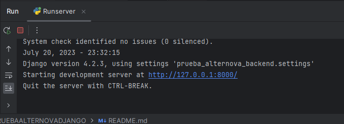
 

- Al ejecutarse si no existe algún error, nos estrega una url donde se encuentra corriendo nuestro proyecto en el servidor "http://127.0.0.1:8000/"


- Si a la ruta anterior le agregamos el admin después del ultimo slash --> "http://127.0.0.1:8000/admin", se vería nuestro administrador de la siguiente manera:


- 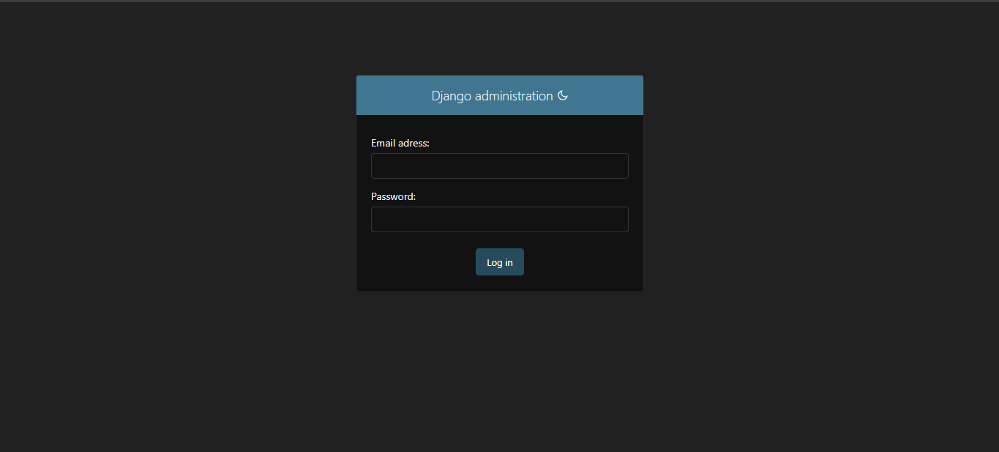

## Crear el usuario para el administrador

- Para la creación de un usuario ejecutamos el siguiente comando en la termina:
```shell
python manage.py createsuperuser
```
- Luego de ejecutar este comando, te pedirá una dirección de correo electrónico y una contraseña. Una vez que hayas introducido esta información, se creará un superusuario y se guardará en la base de datos.


- 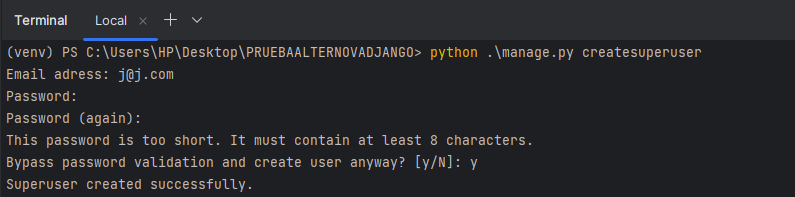

- Una vez que hayas creado un superusuario, puedes iniciar sesión en la interfaz de administración de Django usando el email y la contraseña que proporcionaste.


- Y nuestra interfaz de administración se visualizaría así:
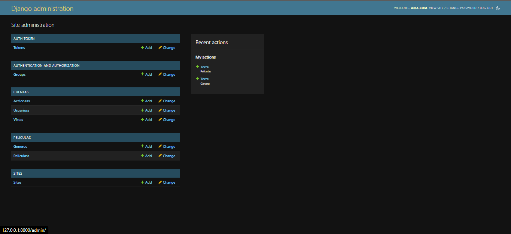

## Consumir Endpoints con postman y la funcionalidad del sistema de autenticación por Token

- Antes de mostrar como consumimos los Endpoints, quiero informarte que para poderlos consumir se les aplico un sistema de autenticación por token que protege los datos de nuestra base de datos y que solo puedes acceder a esos valores si estas registrado como superusuario, este sistema funciona con un código de caracteres que se modifica cada vez que nos logueamos en el admin y con este token podemos acceder a dicha información de cada una de las tablas de nuestro administrador.


- Para consumir nuestros Endpoints o URLS utilizamos como cliente a Postman que nos permite crear, guardar y ejecutar solicitudes a APIs.


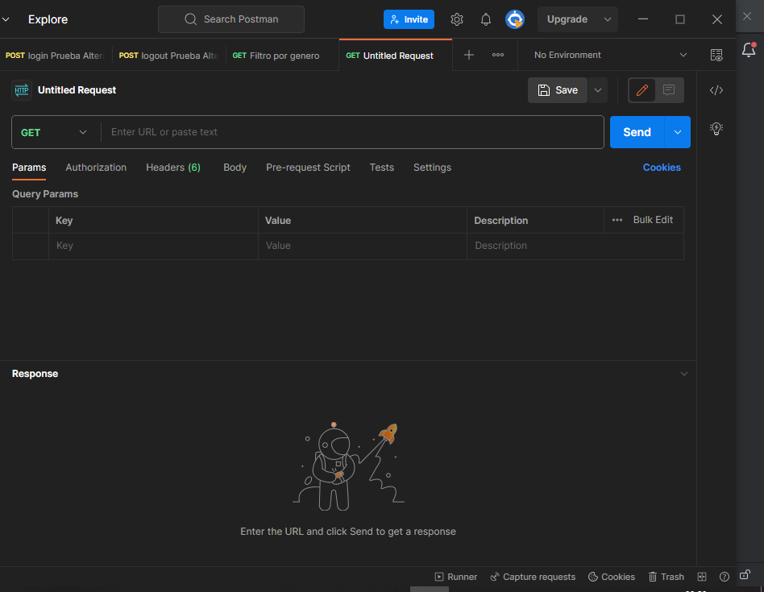

- Primero mostraremos como obtener el token, luego mostraremos como podemos utilizarlo para consumir los Endpoints o URLS, posteriormente mostraremos si no lo utilizamos que respuesta nos devolveríamos y por ultimo mostraremos los resultados de cómo se consumen los otros.


- Consumimos el primer Endpoints donde podemos visualizar la autenticación que le configuramos a los modelos para que el superusuario pueda ingresar a la información de las tablas del administrador:


- Endpoint del Login
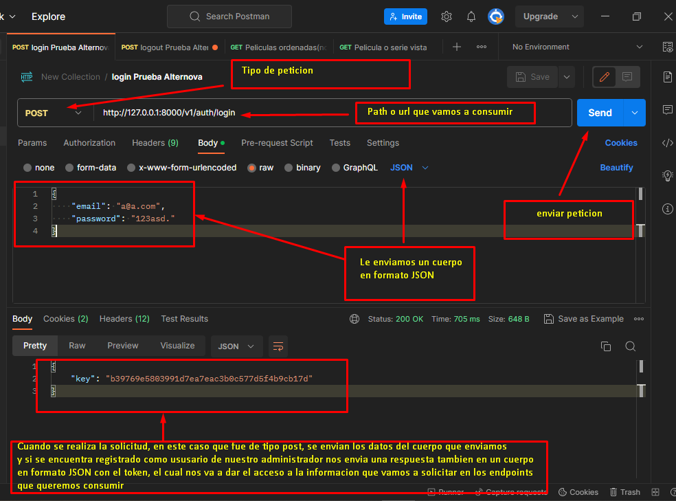


- Después de obtener el token mostrare como se debe de enviar en uno de los Endpoints para consumirlo y también mostrare si no se envía como funciona el sistema de autenticación que no nos mostraría la información sin el token.

1. Consumir Endpoint ingresando el token:
- **Endpoint filtro por nombre**

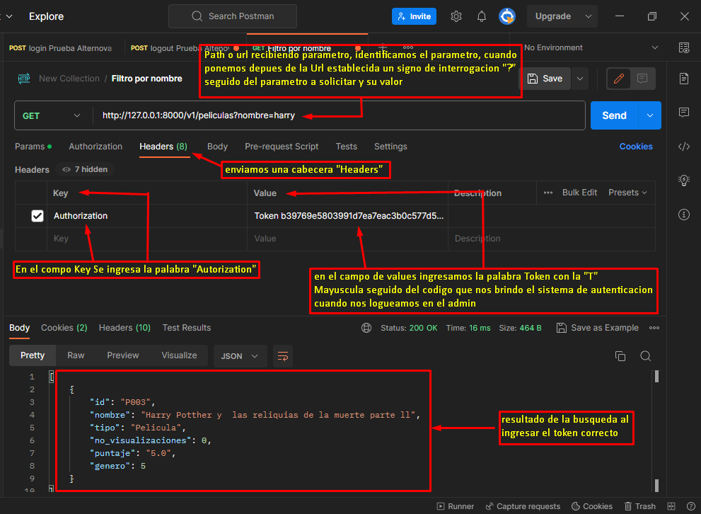


2. Consumir Endpoint sin ingresar el token

- En este ejemplo mostraremos el resultado al consumir un Endpoint o URL sin el token

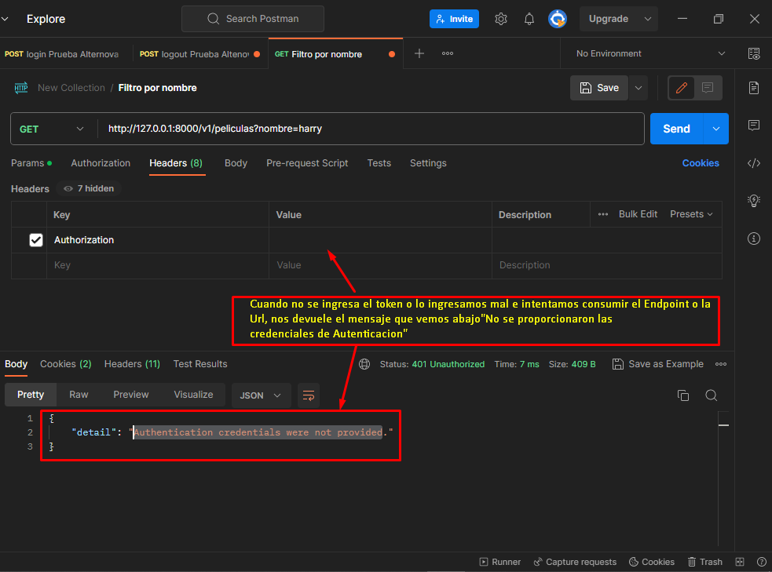

## Resultados de los Endpoints

1. **Endpoint filtro por tipo**

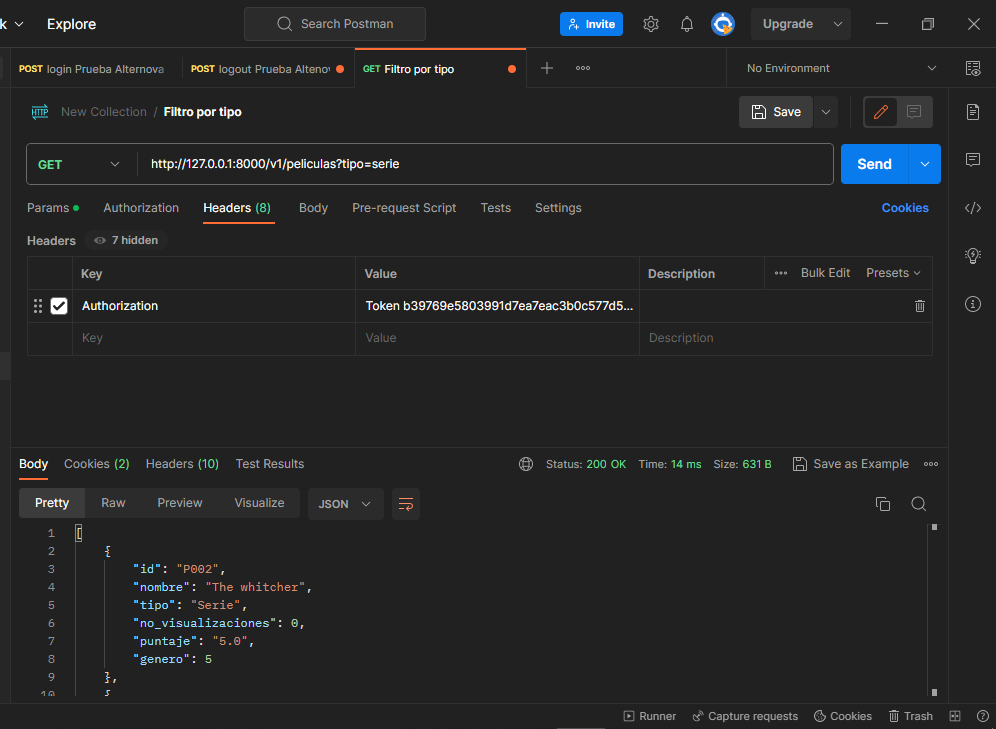


2. **Endpoint filtro por genero**

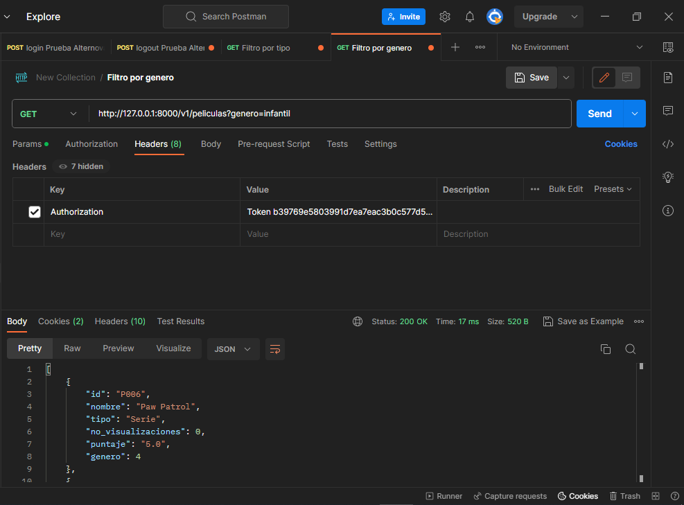


3. **Endpoint obtener películas aleatoriamente**


4. **Endpoint obtener películas organizadas por(nombre, tipo, genero o puntuación)**

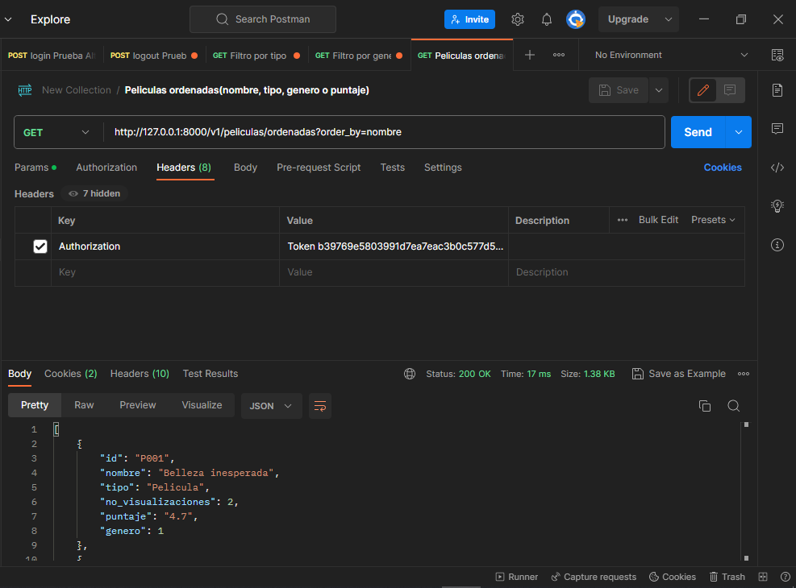


5. **Endpoint calificar película**


6. **Endpoint visualizar una película**

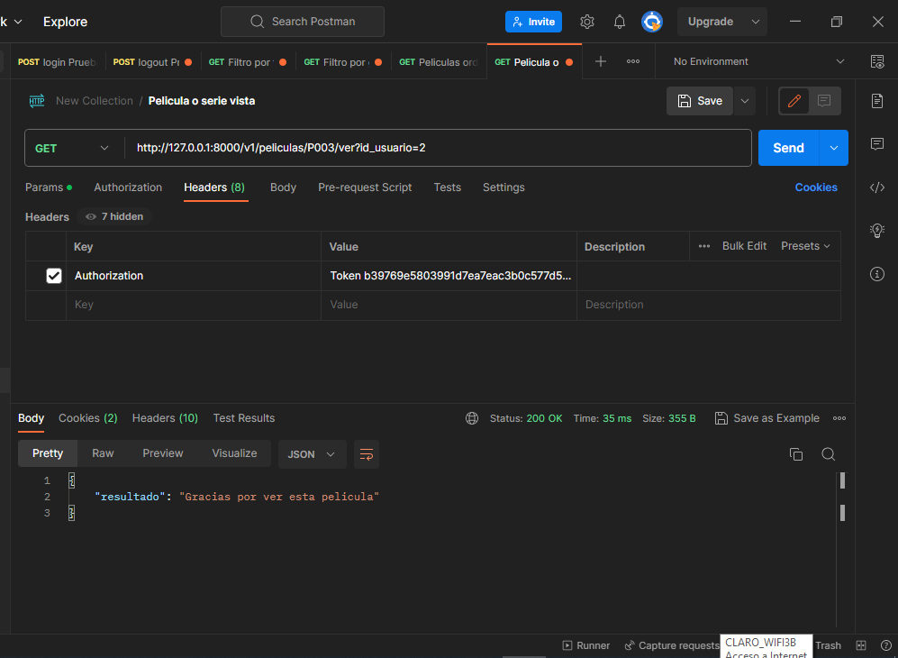
